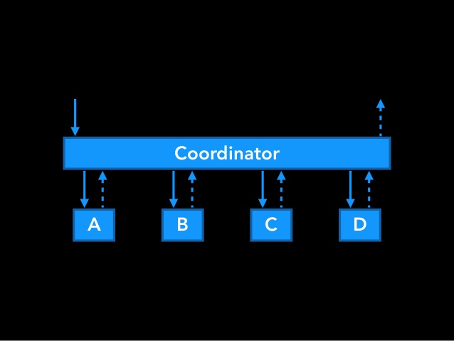

# Coordinator
Using the coordinator pattern in iOS apps let us remove the job of app navigation from our view controllers and appdelegate.

## Study Source
**Article**: Basics of Coordinators
http://khanlou.com/2015/10/coordinators-redux/

**Article**: A series of advaced coordinator
http://khanlou.com/tag/advanced-coordinators/

## Study Notes
**Three Problems**
1.  *Overstuffed App Delegates:*

 >The app delegate is the entry point into any app. Its primary responsibility is shuttling messages back and forth from the operating system to the app’s subsystems. Unfortunately, 
because of its position at the center of everything, it’s extremely easy to just plop stuff in here. 

>One example of this strategy is the root view controller’s configuration.
If you have a tab bar controller as the root of your app, you have to set up all the tab bar controller’s children in appdelegate.

2.  *Too Many Responsibilities on viewcontroller*
 >A small selection of the stuff we have view controllers do:

 >* Model-View Binding
 >* Subview Allocation
 >* Data Fetching
 >* Layout
 >* Data Transformation
 >* Navigation Flow
 >* User Input
 >* Model Mutation
 >* and many more besides
 
3. *Navigation flow*
```
- (void)tableView:(UITableView *)tableView didSelectRowAtIndexPath:(NSIndexPath *)indexPath {  
	id object = [self.dataSource objectAtIndexPath:indexPath];  
	SKDetailViewController *detailViewController = [[SKDetailViewController alloc] initWithDetailObject:object];  
	[self.navigationController pushViewController:detailViewController animated:YES];  
}  
```
> Problems are in 2nd and 3rd line of above code.

> In 2nd line: The view controller is instantiating a new view controller, the next one in the chain, and configuring it. 
The view controller “knows” what’s coming up next in the flow. It knows how that thing is to be configured. 
That means two viewcontrollers create strong dependency with eachother. 

> In 3rd line: The view controller is now grabbing its parent, because remember, these view controllers exist in a hierarchy, 
and then it’s sending a precise message to its parent about what to do. It’s bossing its parent around.  In real life, children should never boss their parents around.

***How MVC Works?***

> In real MVC, Model, View and Controller all three elements connecting with each other; especially Model and View


> But in MVC iOS version, Controller mediates MODEL-VIEW; That leads "Massive Viewcontroller"


**What is a coordinator?**

> A coordinator is an object that bosses one or more view controllers around. Taking all of the driving logic out of your view controllers, and moving that stuff one layer up is gonna make your life a lot more awesome.


> Which responsiblities do coordinators take over from the view controller? 
Primarily, navigation and model mutation. (By model mutation I mean saving the user’s changes to the database, or making a `PUT` or `POST` request to an API, 
anything that can destructively modify the user’s data.)


> It can be presented, it can fetch data, transform it for presentation, display it, but it crucially can’t alter data

> We know now that any time we present a view controller, it won’t take things into its own hands. Whenever it needs to let us know about an event or user input, it uses a delegate method. (closure formate: See in example)



> coordinator can create and configure view controllers, or it can spawn new child coordinators to perform subtasks.

***Code Example***

> It all starts from the app coordinator. The app coordinator solves the problem of the overstuffed app delegate. The app delegate can hold on to the app coordinator and start it up.

>  The app coordinator will set up the primary view controller for the app.

```
    func application(_ application: UIApplication, didFinishLaunchingWithOptions launchOptions: [UIApplication.LaunchOptionsKey: Any]?) -> Bool {
        // Override point for customization after application launch.
        window = UIWindow(frame: UIScreen.main.bounds)
        let rootViewcontroller = UINavigationController()
        self.window?.rootViewController = rootViewcontroller
        coordinator = AppCoordinator(withNavigationController: rootViewcontroller)
        coordinator?.start()
        window?.makeKeyAndVisible()
        return true
    }
```

> AppCoordinator instance stored in App Delegate. One AppCoordinator for an app.

> The coordinator is just a simple Protocol.
```
protocol Coordinator {
    var navigationController: UINavigationController { get }
    init(withNavigationController navigationController: UINavigationController)
    func start()
}
```

> In AppCoordinator
```
class AppCoordinator: Coordinator {
    
    var childCoordinators: [Coordinator] = []
    var navigationController: UINavigationController
    
    required init(withNavigationController navigationController: UINavigationController) {
        self.navigationController = navigationController
    }
    
    func start() {
        self.loadRootTabViewcontroller()
    }
    
}
```

```
private func loadRootTabViewcontroller() {
        let rootViewController = RootViewController()
        
        //TAB 1 : Headline
        let headlineCoordinator = HeadlineCoordinator(withNavigationController: UINavigationController())
        headlineCoordinator.showArticleOnWebView = showArticleOnWebView
        headlineCoordinator.start()
        childCoordinators.append(headlineCoordinator)
        
        //TAB 2 : Source
        let sourcesCoordinator = SourcesCoordinator(withNavigationController: UINavigationController())
        sourcesCoordinator.start()
        childCoordinators.append(sourcesCoordinator)
        
        //TAB 3 : World
        let worldCoordinator = WorldCoordinator(withNavigationController: UINavigationController())
        worldCoordinator.start()
        childCoordinators.append(worldCoordinator)
        
        //TAB 4 : Video
        let videoCoordinator = ViedosCoordinator(withNavigationController: UINavigationController())
        videoCoordinator.start()
        childCoordinators.append(videoCoordinator)
        
        //TAB 5 : More
        let moreCoordinator = MoreCoordinator(withNavigationController: UINavigationController())
        moreCoordinator.start()
        childCoordinators.append(moreCoordinator)
        
        rootViewController.setupTabBarControllerWith(viewControllers: childCoordinators.map{ $0.navigationController })
        navigationController.viewControllers = [rootViewController]
        
        self.showWelcomeScreen()
    }
 ```
    
 ```
    func showWelcomeScreen() {
        guard UserDefaults.standard.bool(forKey: "loginStatus") == false else { return }
        let welcomeCoordinator = WelcomeCoordinator(withNavigationController: UINavigationController())
        welcomeCoordinator.done = { [weak self] in
            self?.navigationController.visibleViewController?.dismiss(animated: true, completion: nil)
            UserDefaults.standard.set(true, forKey: "loginStatus")
            self?.childCoordinators.removeLast()
        }
        welcomeCoordinator.start()
        self.childCoordinators.append(welcomeCoordinator)
            self.navigationController.visibleViewController?.present(welcomeCoordinator.navigationController, animated: true, completion: nil)
    }
```

> We use an array of `childCoordinators` to prevent the child coordinators from getting deallocated.

> When a coordinator signals that its finished, it cleans itself up, popping off whatever view controllers it has added, and then uses delegates (Callback closures) to get messages back up to its parent. and, we can allow the child coordinator to be deallocated

> Observe `done` clouser of welcomeCoordinator in above code

> Whenever anything happens with a view controller (like user input) the view controller will tell its delegate or callback clousers (in this case the coordinator) and the coordinator will execute the actual task that the user intended. It’s important to have the coordinator do the work, so that the view controller remains inert.

***Why are coordinators great?***
1.	Each view controller is now isolated.
> View controllers don’t know anything beyond how to present their data. Whenever anything happens, it tells its delegate (Clousers), but of course it doesn’t know who its delegate is.

> When we do need to have two flows at once, for A/B testing or multiple size classes, you can just swap the entire coordinator object instead of sticking a bunch of conditionals all over your view controllers. If you want to understand the way a flow works, that’s now super easy, since all the code is in one place (In coordinator)2. .

2.	View controllers are now reusable.
> They don’t assume anything about what context they’ll be presented in, or what their buttons will be used for (Logic moved in Coordinator).

> They can be used and reused for their good looks, without dragging any logic along with them.

3. Coordinators separate display-binding from side effects.
> You never again have to worry about if a view controller will mess up your data when you present a view controller. It can only read and display, never write or corrupt data.

***Advance topics on Coordinator***

http://khanlou.com/tag/advanced-coordinators/
