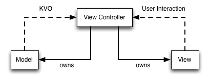

# MVVM

***Study Source***
* https://www.youtube.com/watch?v=sWx8TtRBOfk
* https://www.teehanlax.com/blog/model-view-viewmodel-for-ios/
* https://www.objc.io/issues/13-architecture/mvvm/

***What is MVC?***

Under MVC, all objects are classified as either a model, a view, or a controller. Models hold data, views present an interactive interface to the user, and view controllers mediate the interaction between the model and the view.

> MVC in theroy

1.  The view notifies the controller of any user interaction. The view controller then updates the model to reflect the change of state.
2.  Model then (typically through Key-Value-Observation or delegation) notifies any controllers of updates they need to perform on their views.

> MVC in practice

View and View controller almost always go hand-in-hand together, paired. When is the last time that a view could be paired with different view controllers? Or vice versa? (Tightly coupled)

> But problem is not this, Problem is **Massive View Controller**, WHY?

**Model** objects are typically very, very simple. Often times, they’re Core Data managed objects. According to Apple, models contain data and logic to manipulate that data. In practice, models are often very thin and, for better or worse, model logic gets shuffled into the controller.

**Views** are either UIKit components or programmer-defined collections of UIKit components. These are the pieces that go inside your .xib or Storyboard. Views should never have direct references to models and should only have references to controllers through IBAction events. Business logic that doesn’t pertain to the view itself has no business being there.

That leaves us with controllers. Controllers are where the “glue code” of an app goes: the code that mediates all interactions between models and views. Controllers are responsible for managing the view hierarchy of the view they own. They respond to the view loading, appearing, disappearing, and so on. They also tend to get laden down with the model logic that we kept out of our model and the business logic we kept out of our views.

> Other problems with MVC.

**where do you put network code?** Not in the **model** objects, because that can get tricky because network calls should be done asynchronously, so if a network request outlives the model that owns it, well, it gets complicated. definitely should not put network code in the **view**, so that leaves… controllers. This is a bad idea, too, since it contributes to our Massive View Controller problem.

**Poor Testability** Since view controllers mix view manipulation logic with business logic, separating out those components for the sake of unit testing becomes a herculean task. In true MVVM form, our view controller doesn't even have direct access to the models it displays!

> To solve this problems

***MVVM***

MVVM is an augmented version of MVC where we formally connect the view and controller(we treat them as one), and move presentation logic out of the controller and into a new object, the view model.

Views still don’t have references to the model, but neither do controllers. Instead, they reference the view model.

The view model is an excellent place to put validation logic for user input, presentation logic(like mapping a model value to a formatted string) for the view, kick-offs of network requests, and other miscellaneous code. 

The one thing that does not belong in the view model is any reference to the view itself. (In other words, should not even #import UIKit.h in your viewmodels and you’ll be fine.)

> Why would one want to use MVVM?
* Reduces the complexity of one’s view controllers.
* Since the view model contains all the presentation logic and doesn’t reference the view, it can be fully tested programmatically.

There are three really important points:
* MVVM is compatible with your existing MVC architecture.
* MVVM makes your apps more testable.
* MVVM works best with a binding mechanism.

> Binding mechanism / Data binding

Typically, a view controller observes the view model somehow to know when there's new or updated data to display.

If you look again at the MVVM diagram, will notice that we’ve used the verb “update”, What is Data Binding?: Linking UI to a certain model object through ViewModel automatically(that means any time data changes UI will update automatically).

> MVVM requires two way binding 
1.  Changes to model update UI
2.  User inputes(UI changes) updates model

> how to do that.
* KVO; (but it can quickly become unmanageable.)
* Delegation; (but it can quickly become unmanageable.)
* Function Reactive Programming (Example: using ReactiveCocoa)
* Property Observers (Boxing: http://rasic.info/bindings-generics-swift-and-mvvm/ ) *(Covered in SimpleMVVM demo app)*

> How does ViewModel reduce the complexity of view controllers?

Calculating `what` to display(presentation logic) and `when` to display(Data binding) it is now contained within the view model & Viewcontrollers are responsible for only things like displaying data. In true MVVM form, our view controller doesn't even have direct access to the models it displays!

> Where the network logic of an app should go in MVVM?

I've put it in the view model, but separating it out into its own object. (Somthing like "Networking Service")

**Benefits of MVVM**
* Breaks up ceode by responsibility
* Simplifies Testing
* Code reusability

**Limitations of MVVM**
* Requires binding
* Potential for boilerplate code

***Other Links to study more about reactive MVVM***

https://medium.com/swift-programming/reactive-swift-3b6050375534

https://blog.scottlogic.com/2014/07/24/mvvm-reactivecocoa-swift.html

https://github.com/ReactiveCocoa/ReactiveViewModel

***Discussion on MVVM***

MVVM is Not Very Good: http://khanlou.com/2015/12/mvvm-is-not-very-good/

MVVM is Exceptionally OK: https://ashfurrow.com/blog/mvvm-is-exceptionally-ok/

8 Patterns to Help You Destroy Massive View Controller: http://khanlou.com/2014/09/8-patterns-to-help-you-destroy-massive-view-controller/
