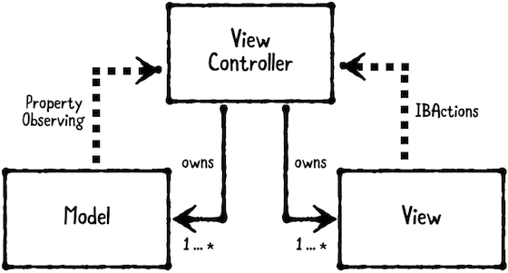
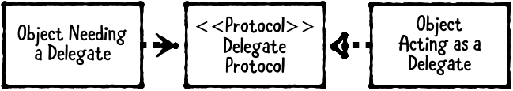
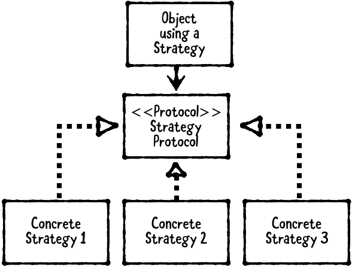

# Design Pattern


***There are three main types of design patterns:***

> 1. Structural design pattern:

Describes how objects are composed and combined to form larger structures. Examples of structural design patterns include Model-View-Controller (MVC), Model-View-ViewModel (MVVM) and Facade.

> 2. Behavioral design pattern: 

Describes how objects communicate with each other. Examples of behavioral design patterns are Delegation, Strategy and Observer.

> 3. Creational design pattern:

Describes how to create or instantiate objects. Examples of creational patterns are Builder, Singleton and Prototype.

`NOTE: There’s an ongoing debate on whether some patterns, including MVVM and MVC, are actually architectural patterns, which span an entire app or subsystem architecture.`


### Model-View-Controller Pattern (Structural)

The model-view-controller (MVC) pattern separates objects into three distinct types. **models, views and controllers!**



* **Models** hold application data. They are usually structs or simple classes.
* **Views** display visual elements and controls on screen. They are usually subclasses of `UIView`. (Custom view and view or controls from UIKIT)
* **Controllers** coordinate between models and views. They are usually subclasses of `UIViewController`.

> MVC is very common in iOS programming, because it's the design pattern that Apple chose to adopt in `UIKit`.

Controllers are allowed to have **strong properties** for their model and view so they can be accessed directly. Controllers may have more than one model and/or view.

Conversely, models and views should **not hold a strong reference** to their owning controller. This would cause a retain cycle.

Instead, models communicate to their controller via property observing, and views communicate to their controller via `IBActions`.

This lets you reuse models and views between several controllers. But Controllers are much harder to reuse.

***When should you use it?***

Use this pattern as a starting point for creating iOS apps.

In nearly every app, you’ll likely need additional patterns besides MVC, but it’s okay to introduce more patterns as your app requires them.

***What should you be careful about?***

MVC is a good starting point, but it has limitations. Not every object will neatly fit into the category of model, view or controller. Consequently, applications that only use MVC tend to have a lot of logic in the controllers. This can result in view controllers getting very big! There's a rather quaint term for when this happens, called "**Massive View
Controller.**"

To solve this issue, You should use other patterns as needed along with MVC.

### Delegation Pattern (Behavioral Pattern)

"*Delegation is a design pattern that enables a class to hand off (or “delegate”) some of its responsibilities to an instance of another class.*"

The delegation pattern enables an object to use another “helper” object to provide data(datasource) or perform a task(delegate) rather than do the task itself. This pattern has three parts: `object needing a delegate`, `delegate
protocol` and a `delegate`:



An **object needing a delegate**, also known as the delegating object. It’s the object that has a delegate. The delegate is usually held as a weak property to avoid a retain cycle. (example: UITableView)

A **delegate protocol**, which defines the methods a delegate may or should implement. (example: UITableViewDelegate Protocol)

A **delegate**, which is the helper object that implements the delegate protocol. (example: Your view controller who conform protocol)

By relying on a delegate protocol instead of a concrete object, the implementation is much more flexible: any object that implements the protocol can be used as the delegate!

***When should you use it?***

Use this pattern to break up large classes or create generic, reusable components.

Delegate relationships are common throughout Apple frameworks, especially UIKit. Both `DataSource-` and `Delegate-` named objects actually follow the delegation pattern, as each involves one object asking another to provide data or do something.

Apple frameworks commonly use the term DataSource to group delegate methods that provide data. For example, `UITableViewDataSource` is expected to provide `UITableViewCells` to display.

Apple frameworks typically use protocols named Delegate to group methods that receive data or events. For example, `UITableViewDelegate` is notified whenever a row is selected.

***What should you be careful about?***

Delegates are extremely useful, but they can be overused. Be careful about creating too many delegates for an object.

If an object needs several delegates, this may be an indicator that it’s doing too much. Consider breaking up the object’s functionality for specific use cases, instead of one catch-all class.

You should also be careful about creating `retain cycles`. Most often, delegate properties should be `weak`. 

### Strategy Pattern (Behavioral)

> In computer programming, the strategy pattern is a behavioral software design pattern that enables selecting an algorithm at runtime. Instead of implementing a single algorithm directly, code receives run-time instructions as to which in a family of algorithms to use.

The strategy pattern defines **a family of interchangeable objects that can be set or switched at runtime**.



**object using a strategy**: object that needs interchangeable behavior.

**strategy protocol** defines methods that every strategy must implement.

**strategies** are objects that conform to the strategy protocol.

***When should you use it?***

Use the strategy pattern when you have two or more different behaviors that are interchangeable.

> Strategy protocol
```
public protocol MovieRatingStrategy {
  var ratingServiceName: String { get }

  func fetchRating(for movieTitle: String,
  success: (_ rating: String, _ review: String) -> ())
}
```
> Strategies
```
public class RottenTomatoesClient: MovieRatingStrategy {
  public let ratingServiceName = "Rotten Tomatoes"
  
  public func fetchRating(for movieTitle: String, success: (_ rating: String, _ review: String) -> ()) {
    // In a real service, you’d make a network request...
    // Here, we just provide dummy values...
    let rating = "95%"
    let review = "It rocked!"
    success(rating, review)
  }
}
```
```
public class IMDbClient: MovieRatingStrategy {
  public let ratingServiceName = "IMDb"
  
  public func fetchRating(for movieTitle: String, success: (_ rating: String, _ review: String) -> ()) {
    // In a real service, you’d make a network request...
    // Here, we just provide dummy values...
    let rating = "3 / 10"
    let review = "It was terrible! The audience was throwing rotten tomatoes!"
    success(rating, review)
  }
}
```
> Object using a strategy `MoviewRatingViewController` & strategy is `movieRatingClient` property
```
public class MoviesRatingViewController: UIViewController {

  public var movieRatingClient: MovieRatingStrategy!

  public override func viewDidLoad() {
    super.viewDidLoad()
    ratingServiceNameLabel.text =
    movieRatingClient.ratingServiceName
  }

  @IBAction public func searchButtonPressed(sender: Any) {
    guard let movieTitle = movieTitleTextField.text else { return }
    //Interchange behaviors.
    movieRatingClient.fetchRating(for: movieTitle) { (rating, review) in
      self.ratingLabel.text = rating
      self.reviewLabel.text = review
    }
  }
}
```
> Interchange behaviors
```
let vc1 = MoviesRatingViewController()
vc1.movieRatingClient = RottenTomatoesClient()
vc1.movieRatingClient.ratingServiceName //"Rotten Tomatoes"

let vc2 = MoviesRatingViewController()
vc2.movieRatingClient = IMDbClient()
vc2.movieRatingClient.ratingServiceName //"IMDb"
```

***Key points***

* The strategy pattern defines a family of interchangeable objects that can be set orswitched at runtime.

* This pattern has three parts: an object using a strategy, a strategy protocol, and a family of strategy objects.

* The strategy pattern is similar to the delegation pattern: Both patterns use a protocol for flexibility. Unlike the delegation pattern, however, strategies are meant to be switched at runtime, whereas delegates are usually fixed.
