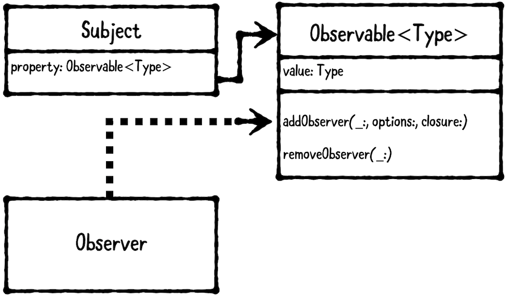

# Design Pattern


***There are three main types of design patterns:***

> 1. Structural design pattern:

Describes how objects are composed and combined to form larger structures. Examples of structural design patterns include Model-View-Controller (MVC), Model-View-ViewModel (MVVM) and Facade.

> 2. Behavioral design pattern: 

Describes how objects communicate with each other. Examples of behavioral design patterns are Delegation, Strategy and Observer.

> 3. Creational design pattern:

Describes how to create or instantiate objects. Examples of creational patterns are Builder, Singleton and Prototype.

`NOTE: There’s an ongoing debate on whether some patterns, including MVVM and MVC, are actually architectural patterns, which span an entire app or subsystem architecture.`


### Model-View-Controller Pattern (Structural)

The model-view-controller (MVC) pattern separates objects into three distinct types. **models, views and controllers!**


* **Models** hold application data. They are usually structs or simple classes.
* **Views** display visual elements and controls on screen. They are usually subclasses of `UIView`. (Custom view and view or controls from UIKIT)
* **Controllers** coordinate between models and views. They are usually subclasses of `UIViewController`.

> MVC is very common in iOS programming, because it's the design pattern that Apple chose to adopt in `UIKit`.

Controllers are allowed to have **strong properties** for their model and view so they can be accessed directly. Controllers may have more than one model and/or view.

Conversely, models and views should **not hold a strong reference** to their owning controller. This would cause a retain cycle.

Instead, models communicate to their controller via property observing, and views communicate to their controller via `IBActions`.

This lets you reuse models and views between several controllers. But Controllers are much harder to reuse.

***When should you use it?***

Use this pattern as a starting point for creating iOS apps.

In nearly every app, you’ll likely need additional patterns besides MVC, but it’s okay to introduce more patterns as your app requires them.

***What should you be careful about?***

MVC is a good starting point, but it has limitations. Not every object will neatly fit into the category of model, view or controller. Consequently, applications that only use MVC tend to have a lot of logic in the controllers. This can result in view controllers getting very big! There's a rather quaint term for when this happens, called "**Massive View
Controller.**"

To solve this issue, You should use other patterns as needed along with MVC.

### Delegation Pattern (Behavioral Pattern)

"*Delegation is a design pattern that enables a class to hand off (or “delegate”) some of its responsibilities to an instance of another class.*"


The delegation pattern enables an object to use another “helper” object to provide data(datasource) or perform a task(delegate) rather than do the task itself. This pattern has three parts: `object needing a delegate`, `delegate
protocol` and a `delegate`:


An **object needing a delegate**, also known as the delegating object. It’s the object that has a delegate. The delegate is usually held as a weak property to avoid a retain cycle. (example: UITableView)

A **delegate protocol**, which defines the methods a delegate may or should implement. (example: UITableViewDelegate Protocol)

A **delegate**, which is the helper object that implements the delegate protocol. (example: Your view controller who conform protocol)

By relying on a delegate protocol instead of a concrete object, the implementation is much more flexible: any object that implements the protocol can be used as the delegate!

***When should you use it?***

Use this pattern to break up large classes or create generic, reusable components.

Delegate relationships are common throughout Apple frameworks, especially UIKit. Both `DataSource-` and `Delegate-` named objects actually follow the delegation pattern, as each involves one object asking another to provide data or do something.

Apple frameworks commonly use the term DataSource to group delegate methods that provide data. For example, `UITableViewDataSource` is expected to provide `UITableViewCells` to display.

Apple frameworks typically use protocols named Delegate to group methods that receive data or events. For example, `UITableViewDelegate` is notified whenever a row is selected.

***What should you be careful about?***

Delegates are extremely useful, but they can be overused. Be careful about creating too many delegates for an object.

If an object needs several delegates, this may be an indicator that it’s doing too much. Consider breaking up the object’s functionality for specific use cases, instead of one catch-all class.

You should also be careful about creating `retain cycles`. Most often, delegate properties should be `weak`. 

### Strategy Pattern (Behavioral)

> In computer programming, the strategy pattern is a behavioral software design pattern that enables selecting an algorithm at runtime. Instead of implementing a single algorithm directly, code receives run-time instructions as to which in a family of algorithms to use.

The strategy pattern defines **a family of interchangeable objects that can be set or switched at runtime**.


**object using a strategy**: object that needs interchangeable behavior.

**strategy protocol** defines methods that every strategy must implement.

**strategies** are objects that conform to the strategy protocol.

***When should you use it?***

Use the strategy pattern when you have two or more different behaviors that are interchangeable.

> Strategy protocol
```
public protocol MovieRatingStrategy {
  var ratingServiceName: String { get }

  func fetchRating(for movieTitle: String,
  success: (_ rating: String, _ review: String) -> ())
}
```
> Strategies
```
public class RottenTomatoesClient: MovieRatingStrategy {
  public let ratingServiceName = "Rotten Tomatoes"
  
  public func fetchRating(for movieTitle: String, success: (_ rating: String, _ review: String) -> ()) {
    // In a real service, you’d make a network request...
    // Here, we just provide dummy values...
    let rating = "95%"
    let review = "It rocked!"
    success(rating, review)
  }
}
```
```
public class IMDbClient: MovieRatingStrategy {
  public let ratingServiceName = "IMDb"
  
  public func fetchRating(for movieTitle: String, success: (_ rating: String, _ review: String) -> ()) {
    // In a real service, you’d make a network request...
    // Here, we just provide dummy values...
    let rating = "3 / 10"
    let review = "It was terrible! The audience was throwing rotten tomatoes!"
    success(rating, review)
  }
}
```
> Object using a strategy `MoviewRatingViewController` & strategy is `movieRatingClient` property
```
public class MoviesRatingViewController: UIViewController {

  public var movieRatingClient: MovieRatingStrategy!

  public override func viewDidLoad() {
    super.viewDidLoad()
    ratingServiceNameLabel.text =
    movieRatingClient.ratingServiceName
  }

  @IBAction public func searchButtonPressed(sender: Any) {
    guard let movieTitle = movieTitleTextField.text else { return }
    //Interchange behaviors.
    movieRatingClient.fetchRating(for: movieTitle) { (rating, review) in
      self.ratingLabel.text = rating
      self.reviewLabel.text = review
    }
  }
}
```
> Interchange behaviors
```
let vc1 = MoviesRatingViewController()
vc1.movieRatingClient = RottenTomatoesClient()
vc1.movieRatingClient.ratingServiceName //"Rotten Tomatoes"

let vc2 = MoviesRatingViewController()
vc2.movieRatingClient = IMDbClient()
vc2.movieRatingClient.ratingServiceName //"IMDb"
```

***Key points***

* The strategy pattern defines a family of interchangeable objects that can be set orswitched at runtime.

* This pattern has three parts: an object using a strategy, a strategy protocol, and a family of strategy objects.

* The strategy pattern is similar to the delegation pattern: Both patterns use a protocol for flexibility. Unlike the delegation pattern, however, strategies are meant to be switched at runtime, whereas delegates are usually fixed.

### Singleton Pattern (Creational)

The singleton pattern restricts a class to only one instance. Every reference to the class refers to the same underlying instance.


The **“singleton plus”** pattern is also common, which provides a shared singleton instance that allows other instances to be created, too.

***When should you use it?***

Use the **singleton pattern** when having more than one instance of a class would cause problems, or when it just wouldn’t be logical.

Use the **singleton plus** pattern if a shared instance is useful most of the time, but you also want to allow custom instances to be created. An example of this is `FileManager`, which handles everything to do with filesystem access. There is a “`default`” instance which is a singleton, or you can create your own. You would usually create your own if you’re using it on a background thread.

***How to create singleton?**

```
public class MySingleton {
  // 1
  static let shared = MySingleton()
  // 2
  private init() { }
}

// 3
let mySingleton = MySingleton.shared
```
1.  You first declare a `public` `static` property called `shared`, which is the singleton instance.
2.  You mark `init` as `private` to prevent the creation of additional instances.
3.  You get the singleton instance by calling `MySingleton.shared`.
4.  `let mySingleton2 = MySingleton()` You’ll get a compiler error if you try to create additional instances of `MySingleton`

***How to create singleton plus?**
```
public class MySingletonPlus {
  // 1
  static let shared = MySingletonPlus()
  // 2
  public init() { }
}

// 3
let singletonPlus = MySingletonPlus.shared
// 4
let singletonPlus2 = MySingletonPlus()
```
1.  You declare a `shared` static property just like a singleton.
2.  Unlike a true singleton, you declare `init` as `public` to allow additional instances to be created.
3.  You get the singleton instance by calling `MySingletonPlus.shared`
4.  You can also create new instances, too.

### Memento Pattern(Behavioral)

The memento pattern allows an object to be saved and restored. It involves three types: the originator, memento and caretaker


The **originator** is the object to be saved or restored; the **memento** is a saved state; and the **caretaker** handles, persists and retrieves mementos. The caretaker is responsible for persisting the memento and, later on,
providing the memento back to the originator to restore the originator’s state.

iOS provides `Encoder` for encoding a memento to, and `Decoder` for decoding from, a memento. This allows encoding and decoding logic to be used across originators.

***When should you use it?***

Use the memento pattern whenever you want to save and later restore an object’s state.

For example, you can use this pattern to implement a save game system, where the originator is the game state (such as level, health, number of lives, etc), the memento is saved data, and the caretaker is the gaming system.

> Originator
```
public class Game: Codable {
  public class State: Codable {
    public var attemptsRemaining: Int = 3
    public var level: Int = 1
    public var score: Int = 0
  }
  
  public var state = State()
  
  public func rackUpMassivePoints() {
    state.score += 9002
  }
  
  public func monstersEatPlayer() {
    state.attemptsRemaining -= 1
  }
}
```

Note: Codable: converts itself(Game) into and out of an external representation(like json). `Codable` is a typealias that combines the `Encodable` and `Decodable` protocols. `typealias Codable = Decodable & Encodable`. `Encodable` can be converted Swift type to an external representation by an `Encoder` (like JSONEncoder). `Decodable` can be converted from an external representation to Swift type by a `Decoder`

> Memento
```
typealias GameMemento = Data
```

> CareTaker
```
public class GameSystem {

  private let decoder = JSONDecoder()
  private let encoder = JSONEncoder()
  
  private let userDefaults = UserDefaults.standard

  public func save(_ game: Game, title: String) throws {
    let data = try encoder.encode(game)
    userDefaults.set(data, forKey: title)
  }

  public func load(title: String) throws -> Game {
    guard let data = userDefaults.data(forKey: title),
    let game = try? decoder.decode(Game.self, from: data)
    else {
      throw Error.gameNotFound
    }
    return game
  }
    
  public enum Error: String, Swift.Error {
    case gameNotFound
  }
}
```
> Test Momento
```
var game = Game()
game.monstersEatPlayer()
game.rackUpMassivePoints()
// Save Game
let gameSystem = GameSystem()
try gameSystem.save(game, title: "Best Game Ever")
// New Game
game = Game()
print("New Game Score: \(game.state.score)") // New Game Score: 0
// Load Game
game = try! gameSystem.load(title: "Best Game Ever")
print("Loaded Game Score: \(game.state.score)") //Loaded Game Score: 9002
```

### Observer Pattern (Behavioral)

The observer pattern lets one object observe changes on another object.

Two different ways to implement the observer pattern in this chapter: Using `key value observation (KVO)`, and using an `Observable` wrapper.



This pattern involves two main objects:
1. The **subject** is the object that’s being observed.
2. The **observer** is the object doing the observing.

Unfortunately, Swift 4 doesn’t yet have language-level support for KVO. Instead, you’re required to `import Foundation` and subclass `NSObject`, which uses the Objective-C runtime to implement KVO. What if you don’t want to, or can’t subclass `NSObject`? You can write your own `Observable` wrapper class instead!

***When should you use it?***

Use the observer pattern whenever you want to receive changes made on another object.

This pattern is often used with MVC, where the view **controller is the observer** and the **model is the subject**. This allows the model to communicate changes back to the view controller without needing to know anything about the view controller’s type. Thereby, different view controllers can use and observe changes on a shared model type.

***USING KVO***
> Subject
```
import Foundation
@objcMembers public class KVOUser: NSObject { //@objcMembers is the same as putting @objc on every property.
  dynamic var name: String 
  public init(name: String) {
    self.name = name
  }
}
```
> Code in Observer
```
let kvoUser = KVOUser(name: "Ray")
//observer object
var kvoObserver: NSKeyValueObservation? = kvoUser.observe(\.name, options: [.initial, .new]) { (user, change) in
  print("User's name is \(user.name)")
}

kvoUser.name = "Rockin' Ray"// Output: User's name is Rockin' Ray

kvoObserver = nil // or explicitly call removeObserver(_:forKeyPath:),
kvoUser.name = "Ray has left the building" //Nothing print
```

**KVO’s biggest downside: You’re required to subclass NSObject and use the Objective-C runtime.**

If you’re not okay with this, you can create your own `Observable` wrapper to get around these limitations.
> `Observable` wrapper
```
import Foundation

public class Observable<Type> {
    // MARK: - Callback
    fileprivate class Callback {
        fileprivate weak var observer: AnyObject?
        fileprivate let options: [ObservableOptions]
        fileprivate let closure: (Type, ObservableOptions) -> Void
        fileprivate init(observer: AnyObject, options: [ObservableOptions], closure: @escaping (Type, ObservableOptions) -> Void) {
            self.observer = observer
            self.options = options
            self.closure = closure
        }
    }
    
    // MARK: - Properties
    public var value: Type {
        didSet {
            removeNilObserverCallbacks()
            notifyCallbacks(value: oldValue, option: .old)
            notifyCallbacks(value: value, option: .new)
        }
    }
    private func removeNilObserverCallbacks() {
        callbacks = callbacks.filter { $0.observer != nil }
    }
    
    private func notifyCallbacks(value: Type, option: ObservableOptions) {
        let callbacksToNotify = callbacks.filter {
            $0.options.contains(option)
        }
        callbacksToNotify.forEach { $0.closure(value, option) }
    }
    
    // MARK: - Object Lifecycle
    public init(_ value: Type) {
        self.value = value
    }
    
    // MARK: - Managing Observers
    private var callbacks: [Callback] = []
    
    public func addObserver(_ observer: AnyObject, removeIfExists: Bool = true, options: [ObservableOptions] = [.new], closure: @escaping (Type, ObservableOptions) -> Void) {
        if removeIfExists {
            removeObserver(observer)
        }
        
        let callback = Callback(observer: observer, options: options, closure: closure)
        callbacks.append(callback)

        if options.contains(.initial) {
            closure(value, .initial)
        }
    }

    public func removeObserver(_ observer: AnyObject) {
        callbacks = callbacks.filter { $0.observer !== observer }
    }
}

// MARK: - ObservableOptions
public struct ObservableOptions: OptionSet {
    public static let initial = ObservableOptions(rawValue: 1 << 0)
    public static let old = ObservableOptions(rawValue: 1 << 1)
    public static let new = ObservableOptions(rawValue: 1 << 2)
    public var rawValue: Int
    public init(rawValue: Int) {
        self.rawValue = rawValue
    }
}
```
> Observable Example
```
// Subject
public class User {
  public let name: Observable<String>
  public init(name: String) {
    self.name = Observable(name)
  }
}

// Observer
public class Observer { }

//Test
let user = User(name: "Madeline") //User's name is Madeline
var observer: Observer? = Observer()

user.name.addObserver(observer!, options: [.initial, .new]) { name, change in
  print("User's name is \(name)")
}

user.name.value = "Amelia" //User's name is Amelia
```

***What should you be careful about?***
For simple models or properties that never change, the observer pattern may beoverkill; it can lead to unnecessary work. Before you implement the observer pattern, define what you expect to change and under which conditions. If you can’t identify a reason for an object or property to change, you’re likely better off not implementing KVO/Observable immediately for it.


