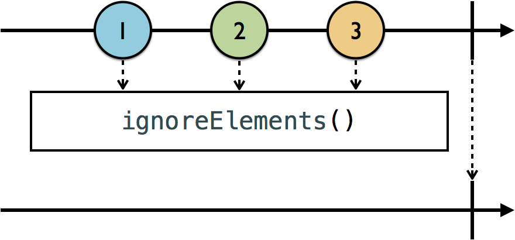
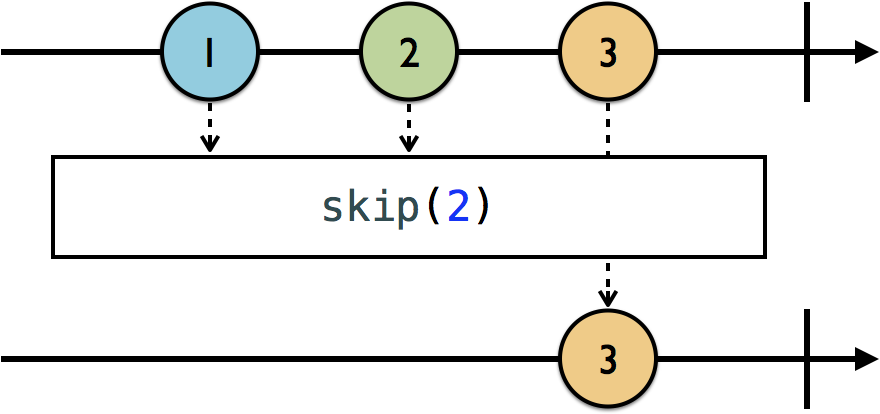
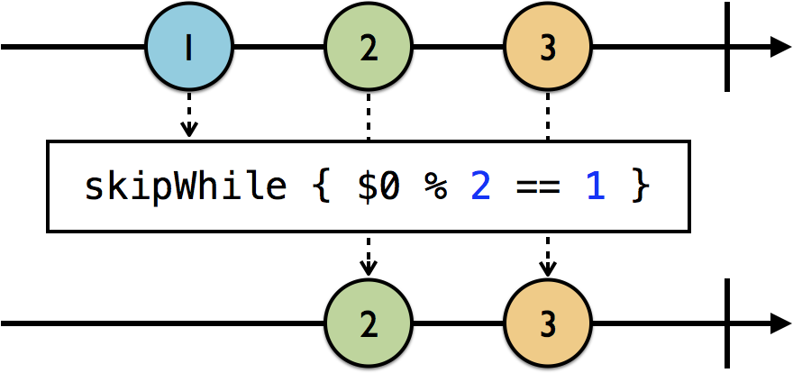
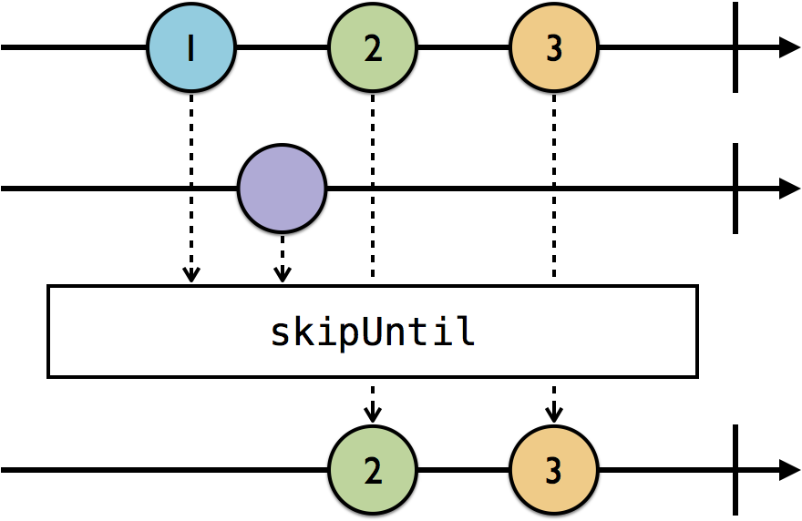
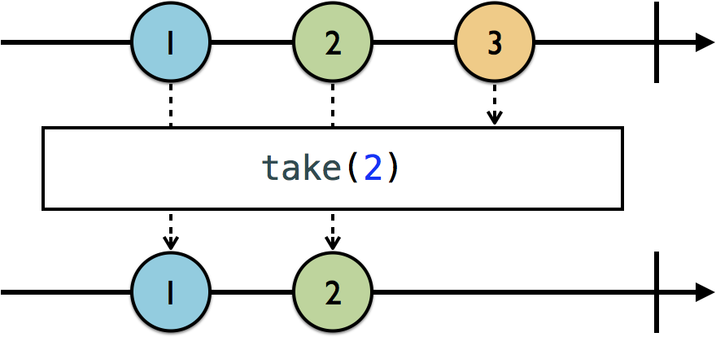
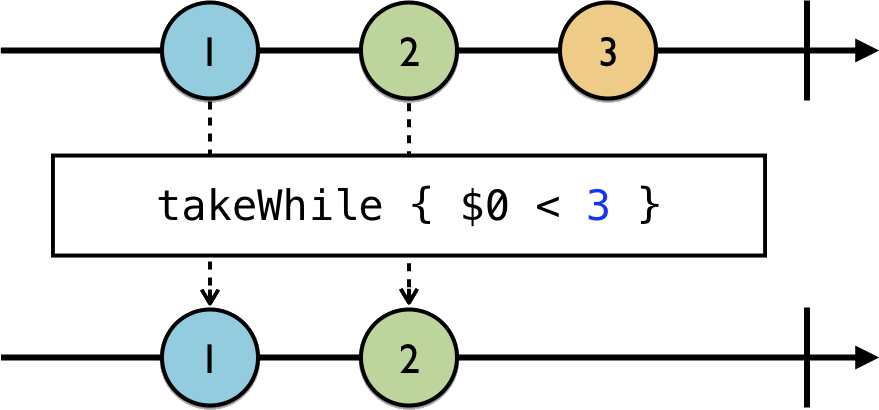
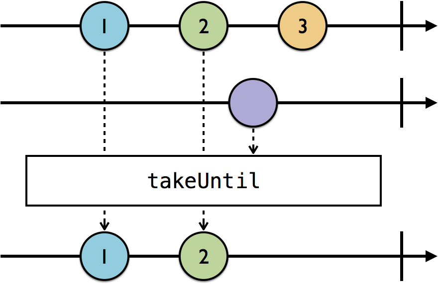

# Operators

The operators operate on the elements of their Observable class and produce a new observable sequence as a result.

Operator allows you to chain operators, one after another, and perform several transformations in sequence.

## Filtering Operators

> **Note**: This type of marble diagram helps to visualize how operators work. The top line is the observable that is being subscribed to. The box represents the operator and its parameters, and the bottom line is the subscriber, or more specifically, what the subscriber will receive after the operator does its thing.

***Ignoring operators***

***`ignoreElements`***: ignore `.next` event elements. It will, however, allow stop events through, such as `.completed` or `.error` events.

`ignoreElements` is useful when you only want to be notified when an observable has terminated, via a `.completed` or `.error` event.



```
    let strikes = PublishSubject<String>()
    let disposeBag = DisposeBag()
    strikes
        .ignoreElements()
        .subscribe { _ in
            print("You're out!")
        }
        .disposed(by: disposeBag)
        
    //next event doesnt print because ignoreElements() operator
    strikes.onNext("X")
    strikes.onNext("X")
    strikes.onNext("X")
    
    //Print
    strikes.onCompleted()

Output:
You're out!
```

`func ignoreElements() -> Completable` you notice that `ignoreElement` actually returns a `Completable`, which makes complete sense given only a completed or error event can be emitted in this case.


***`“elementAt`***: which takes the index of the element you want to receive, and it ignores everything else.

`func elementAt(_ index: Int) -> Observable<String>` returns a `Observable`


```
    let strikes = PublishSubject<String>()
    let disposeBag = DisposeBag()
    
    strikes
        .elementAt(2)
        .subscribe(onNext: { element in
            print(element)
        })
        .disposed(by: disposeBag)
    
    strikes.onNext("A") //0
    strikes.onNext("B") //1
    strikes.onNext("C") //2: Print

Output:
C
```
An interesting fact about `element(at:)` is, that as soon as an element is emitted at the provided index, the subscription will be terminated.

***`filter`***: It takes a predicate closure, which it applies to every element emitted, allowing through only those elements for which the predicate resolves to true.


```
    let disposeBag = DisposeBag()
    
    Observable.of(1, 2, 3, 4, 5, 6)
        .filter { $0 % 2 == 0 }
        .subscribe(onNext: {
            print($0)
        })
        .disposed(by: disposeBag)
Output:
2
4
6
```

***Skipping operators***

***`skip`*** operator allows you to ignore from the 1st to the number you pass as its parameter.



```
    let disposeBag = DisposeBag()
    
    Observable.of("A", "B", "C", "D", "E", "F")
        .skip(3)
        .subscribe(onNext: {
            print($0)
        })
        .disposed(by: disposeBag)

Output:
D
E
F
```

***`skipWhile`*** lets you include a predicate to determine what should be skipped. However, unlike filter, which will filter elements for the life of the subscription, `skipWhile` will only skip up until something is not skipped, and then it will let everything else through from that point on.



```
    let disposeBag = DisposeBag()
    
    
    Observable.of(2, 2, 3, 4, 4)
        .skipWhile { $0 % 2 == 0 }
        .subscribe(onNext: {
            print($0)
        })
        .disposed(by: disposeBag)

Output:
3 // skip ends and everything else going forward
4 // Skip finished in last element
4 
```

> What if you wanted to dynamically filter elements based on some other observable?

***`skipUntil`***, which will keep skipping elements from the source observable (the one you’re subscribing to) until some other trigger observable emits.

`skipUntil` ignores elements emitted by the source observable (the top line) until the trigger observable (second line) emits a .next event. Then it stops skipping and lets everything through from that point on.



```
   let disposeBag = DisposeBag()
    
    let subject = PublishSubject<String>()
    let trigger = PublishSubject<String>()
    
    subject
        .skipUntil(trigger)
        .subscribe(onNext: {
            print($0)
        })
        .disposed(by: disposeBag)
        
    //Skip
    subject.onNext("A")
    subject.onNext("B")
    
    trigger.onNext("X")
    
    subject.onNext("C")

Output:
C
```

***Taking operators*** (Taking is the opposite of skipping.)

`take`, which as shown in this marble diagram, will take the first of the number of elements you specified.



```
    let disposeBag = DisposeBag()
    
    Observable.of(1, 2, 3, 4, 5, 6)
        .take(3)
        .subscribe(onNext: {
            print($0)
        })
        .disposed(by: disposeBag)

Output:
1
2
3
```

***`takeWhile`*** operator that works similarly to `skipWhile`, except you’re taking instead of skipping.



***`enumerated`*** Sometimes you may also want to reference the index of the element being emitted. For that, you can use the `enumerated` operator, which yields tuples containing the index and element of each emitted element from an observable, similar to how the enumerated method in the Swift Standard Library works.

```
let disposeBag = DisposeBag()

Observable.of(2, 2, 4, 4, 6, 6)
    .enumerated()
    .takeWhile { index, integer in
        integer % 2 == 0 && index < 3
    }
    .map { $0.element }
    
    .subscribe(onNext: {
        print($0)
    })
    .disposed(by: disposeBag)

Output:
2
2
4
```

***`takeUntil`***: Like `skipUntil`, there's also a `takeUntil` operator, shown in this marble diagram, taking from the source observable until the trigger observable emits an element.




```
    let disposeBag = DisposeBag()
    
    let subject = PublishSubject<String>()
    let trigger = PublishSubject<String>()
    
    subject
        .takeUntil(trigger)
        .subscribe(onNext: {
            print($0)
        })
        .disposed(by: disposeBag)
    
    subject.onNext("1")
    subject.onNext("2")
    
    trigger.onNext("X")
    subject.onNext("3")

output:
1
2
```

***Distinct operators***

**`distinctUntilChanged`*** only prevents duplicates that are right next to each other, so the second 1 gets through.


```
    let disposeBag = DisposeBag()
    
    Observable.of("A", "A", "B", "B", "A")
        .distinctUntilChanged()
        .subscribe(onNext: {
            print($0)
        })
        .disposed(by: disposeBag)

OUTPUT:
A
B
C
```
`distinctUntilChanged` only prevents contiguous duplicates. So the 2nd element is prevented because it’s the same as the 1st, but the last item, also an A, is allowed through, because it comes after a different letter (B).

These are strings, which conform to `Equatable`. So, these elements are compared for equality based on their implementation conforming to `Equatable`. However, you can provide your own custom comparing logic by using `distinctUntilChanged(_:)`.

Use `distinctUntilChanged(_:)`, which takes a closure.

