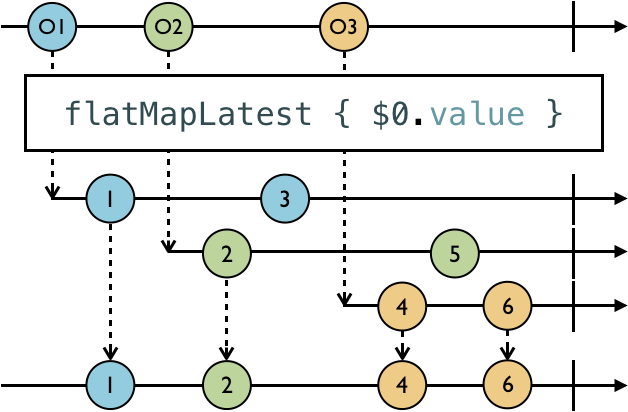

# Operators

The operators operate on the elements of their Observable class and produce a new observable sequence as a result.

Operator allows you to chain operators, one after another, and perform several transformations in sequence.

## Filtering Operators

> **Note**: This type of marble diagram helps to visualize how operators work. The top line is the observable that is being subscribed to. The box represents the operator and its parameters, and the bottom line is the subscriber, or more specifically, what the subscriber will receive after the operator does its thing.

***Ignoring operators***

***`ignoreElements`***: ignore `.next` event elements. It will, however, allow stop events through, such as `.completed` or `.error` events.

`ignoreElements` is useful when you only want to be notified when an observable has terminated, via a `.completed` or `.error` event.


```
    let strikes = PublishSubject<String>()
    let disposeBag = DisposeBag()
    strikes
        .ignoreElements()
        .subscribe { _ in
            print("You're out!")
        }
        .disposed(by: disposeBag)
        
    //next event doesnt print because ignoreElements() operator
    strikes.onNext("X")
    strikes.onNext("X")
    strikes.onNext("X")
    
    //Print
    strikes.onCompleted()

Output:
You're out!
```

`func ignoreElements() -> Completable` you notice that `ignoreElement` actually returns a `Completable`, which makes complete sense given only a completed or error event can be emitted in this case.


***`“elementAt`***: which takes the index of the element you want to receive, and it ignores everything else.

`func elementAt(_ index: Int) -> Observable<String>` returns a `Observable`


```
    let strikes = PublishSubject<String>()
    let disposeBag = DisposeBag()
    
    strikes
        .elementAt(2)
        .subscribe(onNext: { element in
            print(element)
        })
        .disposed(by: disposeBag)
    
    strikes.onNext("A") //0
    strikes.onNext("B") //1
    strikes.onNext("C") //2: Print

Output:
C
```
An interesting fact about `element(at:)` is, that as soon as an element is emitted at the provided index, the subscription will be terminated.

***`filter`***: It takes a predicate closure, which it applies to every element emitted, allowing through only those elements for which the predicate resolves to true.


```
    let disposeBag = DisposeBag()
    
    Observable.of(1, 2, 3, 4, 5, 6)
        .filter { $0 % 2 == 0 }
        .subscribe(onNext: {
            print($0)
        })
        .disposed(by: disposeBag)
Output:
2
4
6
```

***Skipping operators***

***`skip`*** operator allows you to ignore from the 1st to the number you pass as its parameter.


```
    let disposeBag = DisposeBag()
    
    Observable.of("A", "B", "C", "D", "E", "F")
        .skip(3)
        .subscribe(onNext: {
            print($0)
        })
        .disposed(by: disposeBag)

Output:
D
E
F
```

***`skipWhile`*** lets you include a predicate to determine what should be skipped. However, unlike filter, which will filter elements for the life of the subscription, `skipWhile` will only skip up until something is not skipped, and then it will let everything else through from that point on.


```
    let disposeBag = DisposeBag()
    
    
    Observable.of(2, 2, 3, 4, 4)
        .skipWhile { $0 % 2 == 0 }
        .subscribe(onNext: {
            print($0)
        })
        .disposed(by: disposeBag)

Output:
3 // skip ends and everything else going forward
4 // Skip finished in last element
4 
```

> What if you wanted to dynamically filter elements based on some other observable?

***`skipUntil`***, which will keep skipping elements from the source observable (the one you’re subscribing to) until some other trigger observable emits.

`skipUntil` ignores elements emitted by the source observable (the top line) until the trigger observable (second line) emits a .next event. Then it stops skipping and lets everything through from that point on.


```
   let disposeBag = DisposeBag()
    
    let subject = PublishSubject<String>()
    let trigger = PublishSubject<String>()
    
    subject
        .skipUntil(trigger)
        .subscribe(onNext: {
            print($0)
        })
        .disposed(by: disposeBag)
        
    //Skip
    subject.onNext("A")
    subject.onNext("B")
    
    trigger.onNext("X")
    
    subject.onNext("C")

Output:
C
```

***Taking operators*** (Taking is the opposite of skipping.)

`take`, which as shown in this marble diagram, will take the first of the number of elements you specified.


```
    let disposeBag = DisposeBag()
    
    Observable.of(1, 2, 3, 4, 5, 6)
        .take(3)
        .subscribe(onNext: {
            print($0)
        })
        .disposed(by: disposeBag)

Output:
1
2
3
```

***`takeWhile`*** operator that works similarly to `skipWhile`, except you’re taking instead of skipping.


***`enumerated`*** Sometimes you may also want to reference the index of the element being emitted. For that, you can use the `enumerated` operator, which yields tuples containing the index and element of each emitted element from an observable, similar to how the enumerated method in the Swift Standard Library works.

```
let disposeBag = DisposeBag()

Observable.of(2, 2, 4, 4, 6, 6)
    .enumerated()
    .takeWhile { index, integer in
        integer % 2 == 0 && index < 3
    }
    .map { $0.element }
    
    .subscribe(onNext: {
        print($0)
    })
    .disposed(by: disposeBag)

Output:
2
2
4
```

***`takeUntil`***: Like `skipUntil`, there's also a `takeUntil` operator, shown in this marble diagram, taking from the source observable until the trigger observable emits an element.


```
    let disposeBag = DisposeBag()
    
    let subject = PublishSubject<String>()
    let trigger = PublishSubject<String>()
    
    subject
        .takeUntil(trigger)
        .subscribe(onNext: {
            print($0)
        })
        .disposed(by: disposeBag)
    
    subject.onNext("1")
    subject.onNext("2")
    
    trigger.onNext("X")
    subject.onNext("3")

output:
1
2
```

***Distinct operators***

**`distinctUntilChanged`*** only prevents duplicates that are right next to each other, so the second 1 gets through.


```
    let disposeBag = DisposeBag()
    
    Observable.of("A", "A", "B", "B", "A")
        .distinctUntilChanged()
        .subscribe(onNext: {
            print($0)
        })
        .disposed(by: disposeBag)

OUTPUT:
A
B
C
```
`distinctUntilChanged` only prevents contiguous duplicates. So the 2nd element is prevented because it’s the same as the 1st, but the last item, also an A, is allowed through, because it comes after a different letter (B).

These are strings, which conform to `Equatable`. So, these elements are compared for equality based on their implementation conforming to `Equatable`. However, you can provide your own custom comparing logic by using `distinctUntilChanged(_:)`.

Use `distinctUntilChanged(_:)`, which takes a closure.

## Transforming Operators

***`toArray`*** will convert an observable sequence of elements into an array of those elements once the observable completes, and emit a .next event containing that array to subscribers.


```
let disposeBag = DisposeBag()
Observable.of("A", "B", "C")
    .toArray()
    .subscribe(onNext: {
        print($0)
    })
    .disposed(by: disposeBag)

Output:
["A", "B", "C"]
```

***`map`***: RxSwift’s `map` operator works just like Swift’s standard `map`, except it operates on observables.


```
let disposeBag = DisposeBag()

let formatter = NumberFormatter()
formatter.numberStyle = .spellOut

Observable<Int>.of(123, 4, 56)
    .map {
        formatter.string(for: $0) ?? ""
    }
    .subscribe(onNext: {
        print($0)
    })
    .disposed(by: disposeBag)
    
Output:
one hundred twenty-three
four
fifty-six
```

***Transforming inner observables***
RxSwift includes a few operators in the `flatMap` family that allow you to reach into an observable and work with its observable properties. You’re going to learn how to use the two most common ones here.

The first one you’ll learn about is `flatMap`.

Projects each element of an observable sequence to an observable sequence and merges the resulting observable sequences into one observable sequence.


The easiest way to follow what’s happening in this marble diagram is to take each path from the source observable (the top line) all the way through to the target observable that will deliver elements to the subscriber (the bottom line).

The source observable is of an `object type` that has a `value` property that itself is an observable of type Int. It’s value property’s initial value is the number of the object, that is, O1’s initial value is 1, O2’s is 2, and O3’s is 3.

Starting with O1(Object Type), flatMap receives the object and reaches in to project its value property onto a new observable (the 1st line below flatMap just for O1), and that observable is flattened down to the target observable that will deliver elements to the subscriber (the bottom line).

Later, O1’s value(inner observable) property changes to 4, which is not visually represented in the marble diagram (otherwise the diagram would become even more congested). But the evidence that O1’s value has changed is that it is projected onto the existing observable for O1, and then flattened down to the target observable. This all happens in a time-linear fashion.

The next value in the source observable, O2, is received by flatMap, its initial value 2 projected onto a new observable for O2, and then flattened down to the target observable. Later, O2’s value is changed to 5. It is projected and then flattened to the target observable.

Finally, O3 is received by flatMap, its initial value of 3 is projected and flattened.

flatMap projects and transforms an observable value of an observable, and then flattens it down to a target observable.

```
//Object Type
struct Student {
    let score: BehaviorSubject<Int>
}

    let disposeBag = DisposeBag()
    
    let laura = Student(score: BehaviorSubject(value: 80))
    let charlotte = Student(score: BehaviorSubject(value: 90))
    
    let student = PublishSubject<Student>()
    
    student
        .flatMap {
            $0.score
        }
        .subscribe(onNext: {
            print($0)
        })
        .disposed(by: disposeBag)
    
    //Source observeable have Object type elements
    //And it also has inner observeable property
    student.onNext(laura)
    //Inner observeable property is changed
    laura.score.onNext(85)
    
    student.onNext(charlotte)
    //Inner observeable property is changed
    laura.score.onNext(95)
    charlotte.score.onNext(100)
    
Output:
80
85 // Imp
90
95 // Imp
100 // Imp
````

***`flatMapLatest`***

Projects each element of an observable sequence into a new sequence of observable sequences and then transforms an observable sequence of observable sequences into an observable sequence producing values only from the most recent observable sequence.



`flatMapLatest` is actually a combination of two operators, `map` and `switchLatest`.

`flatMapLatest` works just like `flatMap` to reach into an observable element to access its observable property and project it onto a new sequence for each element of the source observable. Those elements are flattened down into a target observable that will provide elements to the subscriber. What makes `flatMapLatest` different is that it will automatically **switch to the latest observable** and **unsubscribe from the the previous one**.

```
let disposeBag = DisposeBag()

let laura = Student(score: BehaviorSubject(value: 80))
let charlotte = Student(score: BehaviorSubject(value: 90))

let student = PublishSubject<Student>()

student
    .flatMapLatest {
        $0.score
    }
    .subscribe(onNext: {
          print($0)
    })
    .disposed(by: disposeBag)
    
    student.onNext(laura)
    laura.score.onNext(85) //Still laura observeable is subscribed
    student.onNext(charlotte) // laura observeable is unsubscribed; Because charlotte is created.
    charlotte.score.onNext(100)
    laura.score.onNext(95) // Dodnt Print; Because laura observeable is unsubscribed
    charlotte.score.onNext(110)
    
Output:
80
85
90
100
110
```
