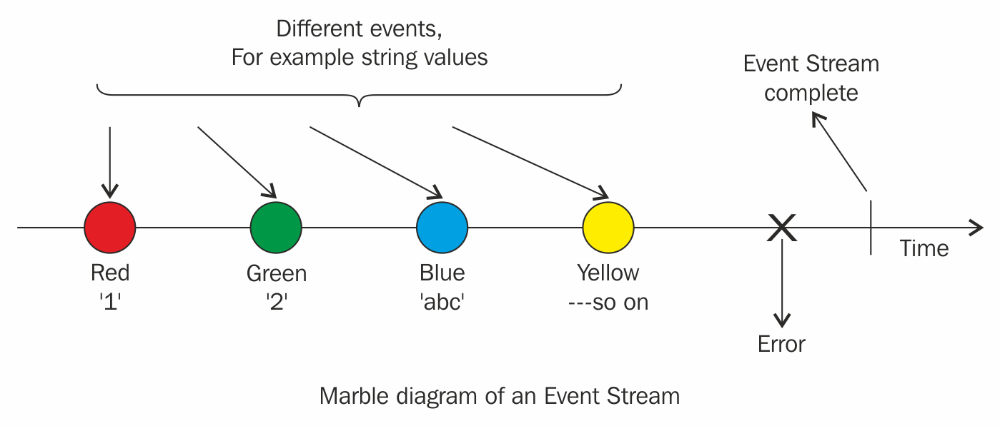

# RxSwift

***FRP Fundamentals, Terminology***

Two different types of programming styles, the imperative and declarative style of doing things in code, and then establish the sweet spot between the two styles where RxSwift sits to take advantage of both programming paradigms.

***What is functional reactive programming (FRP)?***

FRP represents an intersection of two programming paradigms: Functional programming and Reactive programming.

> but before we dig deeper into the concepts, we need to know a bit more about some basic terms.

**Imperative programming**

Traditionally, we write code that describes how it should solve a problem. Each line of code is sequentially executed to produce a desired outcome, which is known as imperative programming.

```
let numbers = [1, 2, 3, 4, 5, 6, 7, 8, 9]
var numbersLessThanFive = [Int]()
for index in 0..<numbers.count 
    {
    if numbers[index] > 5 
        {
        numbersLessThanFive.append(numbers[index])
        }
    }
```

As you can see, we sequentially execute a series of instructions to produce a desired output.

***Functional programming***
Functional programming is a programming paradigm where you model everything as a result of a function that avoids changing `state` and `mutating data`.

```
let numbers = [1, 2, 3, 4, 5, 6, 7, 8, 9]
let numbersLessThanFive = numbers.filter { $0 < 5 }
```

> Notice the declaration of the two arrays in both the examples.

In the first example, the numbersLessThanFive array was declared as a `var`, whereas in the second example, the same array was declared as a `let`. Which approach is better, which array is safer to work with? What if more than one thread is trying to work with the same array and its elements? Isn't a constant array more reliable?

***Reactive programming***

Reactive programming is the practice of programming with *asynchronous data streams or event streams*. (An event stream can be anything like keyboard inputs, button taps, gestures etc). You can listen to a stream and react to it accordingly.

***Functional reactive programming*** is the combination of *functional* and *reactive* paradigms, or to be more concise, it is reacting to data streams using the functional paradigm.

***Basic building blocks of FRP***
* **Event streams**:

An event stream can be defined as a sequence of events happening over time.



As you can see, we have expressed time on the arrow aligned from left to right, moving forward to the right, and events happen over time. We can add an event listener to the whole sequence and whenever an event happens, WE CAN REACT TO IT.

> Example

`var array = ["1", "2", "abc",  "3", "4", "cdf", "6"]`

So let's say that our problem is to add all the numbers in the given array. As you can see, the elements in the array are not numbers; they are strings, so we have to do some transformations here and go over a loop to filter out the strings that cannot be converted to a number and then add the rest if they are a valid number and add them finally. we will use the `map` and `filter` operations to provide a solution to the problem, which is the functional approach.

```
let result = array.map({// inside map we will ... to integers
}).filter {
// filter all the non integers to form a pure integer array
}.reduce(0,+)
```

We can do the same thing with *event streams*(Chaining `map`, `filter` and `reduce`), the only difference being the availability of events at intermittent time intervals. As a result, processing of the event stream will take its own time and the result will not be populated instantaneously.


***RxSwift*** is a library for composing asynchronous and event-based code by using
observable sequences and functional style operators, allowing for parameterized
execution via schedulers.

> In simple word

RxSwift; Simplifies developing asynchronous programs by allowing your code to react to new data and process it in a sequential, isolated manner.

Although, Apple provides lots of APIs in the iOS SDK that help you write asynchronous code. Like;
* Grand Centeral Dispatch
* Operation Queue
* NotificationCenter
* Delegate pattern
* Closures

The issue is that complex asynchronous code becomes very difficult to write in part because of the variety of APIs that Apple’s SDK offers;. the core issues with writing asynchronous code are: a) the order in which pieces of work are performed and b) shared mutable data. Luckily, these are some of RxSwift’s strong suits!

