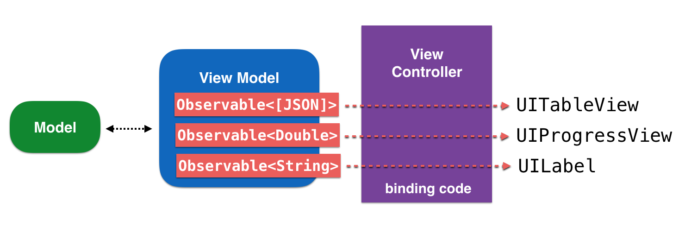

# RxSwift

***Study Source***
* [Reactive Programming Swift - Navdeep Singh](https://github.com/bhaveshtandel17/iOS-A-to-Z/blob/master/Functional_reactive_programming/RxSwift/Files/reactive-programming-swift-4.epub)

* [RxSwift Docs](https://github.com/ReactiveX/RxSwift/blob/master/Documentation/GettingStarted.md)

***FRP Fundamentals, Terminology***

Two different types of programming styles, the imperative and declarative style of doing things in code, and then establish the sweet spot between the two styles where RxSwift sits to take advantage of both programming paradigms.

***What is functional reactive programming (FRP)?***

FRP represents an intersection of two programming paradigms: Functional programming and Reactive programming.

> but before we dig deeper into the concepts, we need to know a bit more about some basic terms.

**Imperative programming**

Traditionally, we write code that describes how it should solve a problem. Each line of code is sequentially executed to produce a desired outcome, which is known as imperative programming.

```
let numbers = [1, 2, 3, 4, 5, 6, 7, 8, 9]
var numbersLessThanFive = [Int]()
for index in 0..<numbers.count 
    {
    if numbers[index] > 5 
        {
        numbersLessThanFive.append(numbers[index])
        }
    }
```

As you can see, we sequentially execute a series of instructions to produce a desired output.

***Functional programming***
Functional programming is a programming paradigm where you model everything as a result of a function that avoids changing `state` and `mutating data`.

```
let numbers = [1, 2, 3, 4, 5, 6, 7, 8, 9]
let numbersLessThanFive = numbers.filter { $0 < 5 }
```

> Notice the declaration of the two arrays in both the examples.

In the first example, the numbersLessThanFive array was declared as a `var`, whereas in the second example, the same array was declared as a `let`. Which approach is better, which array is safer to work with? What if more than one thread is trying to work with the same array and its elements? Isn't a constant array more reliable?

***Reactive programming***

Reactive programming is the practice of programming with *asynchronous data streams or event streams*. (An event stream can be anything like keyboard inputs, button taps, gestures etc). You can listen to a stream and react to it accordingly.

***Functional reactive programming*** is the combination of *functional* and *reactive* paradigms, or to be more concise, it is reacting to data streams using the functional paradigm.

***Basic building blocks of FRP***
* **Event streams / sequence**:

An event stream can be defined as a sequence of events happening over time.


As you can see, we have expressed time on the arrow aligned from left to right, moving forward to the right, and events happen over time. We can add an event listener to the whole sequence and whenever an event happens, WE CAN REACT TO IT.

> Example

`var array = ["1", "2", "abc",  "3", "4", "cdf", "6"]`

So let's say that our problem is to add all the numbers in the given array. As you can see, the elements in the array are not numbers; they are strings, so we have to do some transformations here and go over a loop to filter out the strings that cannot be converted to a number and then add the rest if they are a valid number and add them finally. we will use the `map` and `filter` operations to provide a solution to the problem, which is the functional approach.

```
let result = array.map({// inside map we will ... to integers
}).filter {
// filter all the non integers to form a pure integer array
}.reduce(0,+)
```

We can do the same thing with *event streams*(Chaining `map`, `filter` and `reduce`), the only difference being the availability of events at intermittent time intervals. As a result, processing of the event stream will take its own time and the result will not be populated instantaneously.

* **State or shared mutable state**:
consider an example. Suppose you bought a car and on the first day, you started the car and went for a drive. Everything just runs fine and smoothly. To start the car, you insert the key and rotate it clockwise; in the background, the spark plug ignites a controlled flow of fuel and your engine comes to life. This state of your car is the started state. You then switch the gear to drive mode and press the accelerator with your right foot. Voila! The car starts moving and now you can call this state of your car running and eventually you will stop your car at the destination, and then the state of the car will change accordingly.So you noticed that your actions or inputs, engine ignition, pistons running, and so on—the sum of all the activities and processes either in foreground or background—comprise the state of the car.(it is mutable)


Mapping the same concept to the apps we build, each and every application has a state at any given instance of time. The application might be fetching data from a web service in the background, playing a song in the media player, responding to user inputs, and such—all these actions or processes (synchronous and asynchronous) at any given point in time are collectively termed the state of the application.(it is our responsibility to manage the state of an app at any instance in time, especially dealing with multiple asynchronous tasks simultaneously.)

* **Side effects**:

Side effects occur when the state of the system/App changes because of the execution of a function. For example, suppose a function named addAndStoreValue() adds two integers and stores the result in the local database and raises a notification for the view to refresh in order to reflect the resulting value, then that change in the view will be the side effect that this function causes because of its execution.(In other words, the state of the app changed once the function was executed. This change is called a side effect.) 

You must be thinking that side effects are not bad at all; actually, that is the reason we code and execute our programs. We want the state of the system/apps to change once the program has executed.

> we have understood that causing side-effects is desired, then what's the issue?

The issue with side-effects is that; We want to control the execution to cause side-effects in a predictable manner and predicte the state of the device once our app starts running. We also need to segregate our app in modules to identify which pieces of code change the state of the app and which pieces process and output data.

RxSwift addresses the preceding issues by making use of declarative coding and creating reactive systems. A well-written app differentiates code that causes side-effects from the rest of the program; as a result of this testing the app becomes easier, extending the functionality becomes clear, refactoring and debugging become a straightforward process, and maintaining such a code base is hassle-free. RxSwift serves a great deal in order to isolate side effects as expected.

* **Immutability**:

An immutable object is an object that cannot be changed over the course of its existence or scope, whereas a mutable object can be changed within its scope.

Functional programming promotes the concept of immutability:
```
let numbers = [1, 2, 3, 4, 5, 6, 7, 8, 9]
let numbersLessThanFive = numbers.filter { $0 < 5 }
```
Did you note how we can create a new numbersLessThanFive array as a `constant` rather then a `variable`? Try creating a similar array with imperative programming:
```
var numbersLessThanFive = [Int]()
for index in 0..< numbers.count 
    {
    if numbers[index] > 5 
        {
        numbersLessThanFive.append(numbers[index])
        }
    }
```
As any other thread executing in the memory can now change the values in this array since the array is now a variable (lossy data flow).

Since one aspect of functional reactive programming comprises a lot of functional programming, working with immutable data comes naturally while modeling logic in the FRP way and hence half the problems are addressed from the start.

Drawbacks: Since immutable objects cannot be changed over time during execution, it means they come at an cost and might not be reusable in certain scenarios. You have to dispose an immutable object or populate a new one if the current one does not fit the context.

As you can see, there are certain drawbacks while working with immutable data types. We need to strike a balance between both to maintain a shared state to suit the problem at hand. More immutable data types mean more deterministic behavior.

* **Declarative**:

In imperative programming, you change state at will. In functional programming, you aim to minimize the code that causes side effects. Since you don’t live in a perfect world, the balance lies somewhere in the middle. RxSwift combines some of the best aspects of imperative code and functional code.

> How?

**Declarative code** lets you define pieces of behavior. RxSwift will run these behaviors any time there’s a relevant event and provide an immutable, isolated piece of data to work with.

***RxSwift foundation***

Reactive programming has been in the picture for more than 20 years now, but it did not really start to gain momentum until the introduction of reactive extensions in 2009. **Reactive extensions** or **Rx**

**RxSwift** finds the sweet spot between traditionally imperative Cocoa code and purist functional code.

Rx also implements the iterator pattern, which is how sequences can be traversed. ([sequence](https://developer.apple.com/documentation/swift/sequence) and [iteratorprotocol](https://developer.apple.com/documentation/swift/iteratorprotocol) in swift) (Note: Rx, Everything is a Sequence)

> Definition Of RXswift

***RxSwift*** is a library for composing asynchronous and event-based code by using
**observable sequences** and functional style **operators**, allowing for parameterized
execution via **schedulers**. 

> “The three building blocks of Rx code are **observables**, **operators** and **schedulers**.

***Observable***

The Observable<T> class provides the foundation of Rx code: the ability to asynchronously produce a sequence of events.
    
Every `Observable` sequence is just a sequence. The key advantage for an `Observable` vs Swift's `Sequence` is that it can also receive elements asynchronously. 

*   `Observable(ObservableType)` is equivalent to `Sequence`
*   `ObservableType.subscribe` method is equivalent to `Sequence.makeIterator` method.
*   `Observer (callback)` needs to be passed to `ObservableType.subscribe` method to receive sequence elements instead of calling next()(in `Sequence`) on the returned iterator.

***It is important to understand the lifecycle of an Observable sequence.***

An observable sequence can emit things known as `events`. It can emit zero or more events; when a value is added to or put onto a sequence, it will send a `next` event containing that value to its observers. This is known as emitting.

If an error is encountered, A sequence can emit an error event containing an `error` type.

A sequence can also terminate normally and in doing so it will emit a `completed` event.

If at any point you want to stop observing a sequence, you can cancel the subscription by calling `dispose()` on it; this is like removing an observer in KVO or the notification center API, or you can also just add subscriptions to an instance of `DisposeBag`, which will take care of properly canceling subscriptions on `deinit()` for you.

two different kinds of observable sequences: finite and infinite.

**Finite**: Some observable sequences emit zero, one or more values, and, at a later point, either terminate successfully or terminate with an error.

**Infinite**: there are other sequences which are simply infinite. Often, UI events are such infinite observable sequences.

***Marble diagrams***

http://rxmarbles.com/

***Subject***

Subject is a special type in RxSwift that can act as both of these:

*   An `Observable` sequence, which means it can be subscribed to
*   An `Observer` that enables adding new elements onto a subject that will then be emitted to the subject subscribers

There are four subject types in RxSwift:
1.  PublishSubject
2.  BehaviorSubject
3.  ReplaySubject
4.  Variable

***Operators***

Operators mostly take in asynchronous input and only produce output without causing side effects,

ObservableType and the implementation of the Observable class include plenty of methods that abstract discrete pieces of asynchronous work, which can be composed together to implement more complex logic.

```
UIDevice.rx.orientation
  .filter { value in
    return value != .landscape
  }
  .map { _ in
    return "Portrait is the best!"
  }
  .subscribe(onNext: { string in
    showAlert(text: string)
  })
```

First, `filter` will only let through values that are not `.landscape`. If the device is in landscape mode, the subscription code will not get executed because `filter` will suppress these events.

In case of `.portrait` values, the map operator will take the Orientation type input and convert it to a String output — the text "Portrait is the best!"

Finally, with `subscribe`, you subscribe for the resulting next event, this time carrying a String value, and you call a method to display an alert with that text onscreen.

The operators are also highly **composable**(Not change state) — they always take in data as input and output their result, so you can easily chain them in many different ways achieving so much more than what a single operator can do on its own

***Schedulers***

Schedulers are an abstraction that let you specify distinct queues on which to perform work. It is always a good idea to move all the intensive work off the main thread to keep it as responsive as possible for users, and schedulers make it easy to do this. They can be Serial or Concurrent. You will use a serial scheduler if you want to ensure that work is carried out on that queue in the order it was added to the queue, otherwise you will typically just use a concurrent queue.

There are built-in scheduler types that work with Grand Central Dispatch (GCD) queues and NSOperationQueues. These are as listed:

*   `SerialDispatchQueueScheduler`, which will dispatch work on a specified `serial dispatch` queue
*   `ConcurrentDispatchQueueScheduler`, which will dispatch work on a `concurrent dispatch` queue
*   `OperationQueueSchedule`r, which will perform the work on a specified `NSOperations` queue

You can also create your own custom schedulers by conforming to the `ImmediateScheduler` protocol.

***App architecture***

RxSwift and MVVM definitely do play nicely together. The reason MVVM and RxSwift go great together is that a ViewModel allows you to expose Observable<T> properties, which you can bind directly to UIKit controls in your View controller's glue code. This makes binding model data to the UI very simple to represent and to code:





### [Observable in details](https://github.com/bhaveshtandel17/iOS-A-to-Z/tree/master/Functional_reactive_programming/RxSwift/Observable)

### [Subject in details](https://github.com/bhaveshtandel17/iOS-A-to-Z/tree/master/Functional_reactive_programming/RxSwift/Subject)

## Projects Info

*   **v1Combinestagram**: To practice on basic understanding of Observable and Subject.
