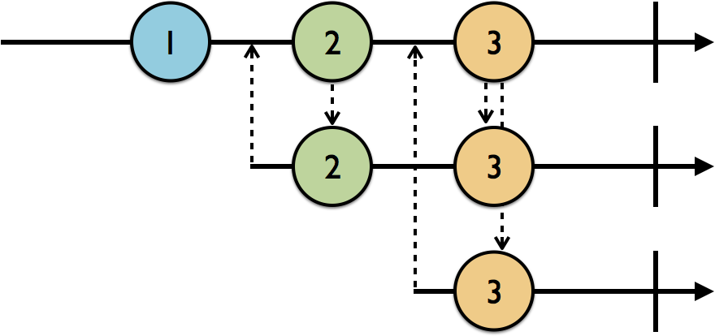

# Subject

Notice below code:
```
let disposeBag = DisposeBag()

let subject = PublishSubject<String>()

subject.on(.next("This element will not print: Added before PublishSubject is subscribed"))

// PublishSubject is subscribed; //act as observer
subject.subscribe(onNext: { string in
print(string)
}).disposed(by: disposeBag)

//act as observable
subject.on(.next("First element: Could print"))

subject.on(.completed)

subject.on(.next("Second element: couldnt print because PublishSubject is completed."))
```

Subjects act as both an **observable** and an **observer**. You saw earlier how they can receive events and also be subscribed to.

In above example; The subject received `.next` events, and every time it receives an event, it turns around and emits it to its subscribers.

***There are four subject types in RxSwift***

* `PublishSubject`: Starts empty and only emits new elements to subscribers.
* `BehaviorSubject`: Starts with an initial value and replays it or the latest element to new subscribers.
* `ReplaySubject`: Initialized with a buffer size and will maintain a buffer of elements up to that size and replay it to new subscribers.
* `AsyncSubject`: Emits only the last `.next` event in the sequence, and only when the subject receives a `.completed` event.

> Two relay types that wrap subjects

* `PublishRelay` and `BehaviorRelay`: These wrap their relative subjects, but only accept `.next` events. You cannot add a `.completed` or `.error` event onto relays at all, so they're great for non-terminating sequences.

***Working with publish subjects***

Publish subjects come in handy when you simply want subscribers to be notified of new events from the point at which they subscribed, until they either unsubscribe, or the subject has terminated with a .completed or .error event.

```
let disposeBag = DisposeBag()
        
let subject = PublishSubject<String>()
        
//PublishSubject is not subscribed yet.
subject.on(.next("Is anyone listening?: No"))
        
// Added 1st subscriber
let subscriptionOne = subject.subscribe({ event in
    print("subscription 1)", event.element ?? event)
})
        
//Print 1 : subscription 1) 1
//PublishSubject is subscribed with "subscriptionOne".
subject.on(.next("1"))
        
// Added 2nd subscriber
let subscriptionTwo = subject.subscribe({ event in
    print("subscription 2)", event.element ?? event)
})
        
//Print 2 : subscription 1) 2
//Print 3 : subscription 2) 2
//PublishSubject is subscribed with "subscriptionOne" and "subscriptionTwo".
subject.onNext("2")
        
//subscriptionOne dispose
subscriptionOne.dispose()
        
//Print 4 : subscription 2) 3
//PublishSubject is subscribed with "subscriptionTwo".
subject.onNext("3")
        
//Print 5 : subscription 2) completed
//PublishSubject is subscribed with "subscriptionTwo".
subject.onCompleted()
        
//subject is already completed; this event is useless
subject.onNext("4")
        
//subscriptionOne dispose
subscriptionTwo.dispose()
        
//Print 6 : subscription 3) completed
//subject is already completed. So print completed only
//PublishSubject is subscribed with "subscription three".
subject.subscribe {
    print("subscription 3)", $0.element ?? $0)
}.disposed(by: disposeBag)

//subject is already completed; this event is useless
subject.onNext("?")


Output:
subscription 1) 1
subscription 1) 2
subscription 2) 2
subscription 2) 3
subscription 2) completed
subscription 3) completed
```

In the following marble diagram, the top line is the publish subject and the second and third lines are subscribers. The upward-pointing arrows indicate subscriptions, and the downward-pointing arrows represent emitted events.



***Working with behavior subjects***

Behavior subjects work similarly to publish subjects, **except they will replay the latest `.next` event** to new subscribers. 

You can’t create one without providing an initial value. If you can’t provide an initial value at creation time, that probably means you need to use a PublishSubject instead.

Check out this marble diagram:


The first line from the top is the subject. The first subscriber on the second line down subscribes after 1 but before 2, so it gets 1 immediately upon subscription, and then 2 and 3 as they’re emitted by the subject. Similarly, the second subscriber subscribes after 2 but before 3, so it gets 2 immediately and then 3 when it’s emitted.

```
let disposeBag = DisposeBag()
        
let subject = BehaviorSubject(value: "Initial Value")
        
//Since BehaviorSubject always emits the latest element.
//Print 1: 1==>Initial Value
subject.subscribe({ event in
        print("1==>", event.element ?? event)
}).disposed(by: disposeBag)
        
//Print 2: 1==>A
subject.onNext("A")
        
//Print 3: 2==>A
subject.subscribe({ event in
        print("2==>", event.element ?? event)
}).disposed(by: disposeBag)
        
//Print 4: 1==>error(anError)
//Print 5: 2==>error(anError)
//subject terminated bt error
subject.onError(MyError.anError)
        
//Print 6: 3==>error(anError)
subject.subscribe({ event in
        print("3==>", event.element ?? event)
}).disposed(by: disposeBag)

Output:
1==> Initial Value
1==> A
2==> A
1==> error(anError)
2==> error(anError)
3==> error(anError)
```

But what if you wanted to show more than the latest value? For example, on a search screen, you may want to show the most recent five search terms used. This is where replay subjects come in.

***Working with Replay subjects***

Replay subjects will temporarily cache, or buffer, the latest elements they emit, up to a specified size of your choosing. They will then replay that buffer to new subscribers.

The following marble diagram depicts a replay subject with a buffer size of 2. 


The first subscriber (middle line) is already subscribed to the replay subject (top line) so it gets elements as they’re emitted. The second subscriber (bottom line) subscribes after 2, so it gets 1 and 2 replayed to it.

```
        let disposeBag = DisposeBag()
        
        let subject = ReplaySubject<String>.create(bufferSize: 2)
        
        subject.onNext("A")
        
        //Print: 1==> A
        subject.subscribe({ event in
            print("1==>", event.element ?? event)
        }).disposed(by: disposeBag)
        
        //Print: 1==> A
        subject.onNext("B")
        
        //Print: 2==> A
        //Print: 2==> B
        subject.subscribe({ event in
            print("2==>", event.element ?? event)
        }).disposed(by: disposeBag)
        
        //Print: 1==> C
        //Print: 2==> C
        subject.onNext("C")
        
        //Print: 3==> B
        //Print: 3==> C
        subject.subscribe({ event in
            print("3==>", event.element ?? event)
        }).disposed(by: disposeBag)
        
        //Print: 1==> error(anError)
        //Print: 2==> error(anError)
        //Print: 3==> error(anError)
        subject.onError(MyError.anError)
        
        //Print: 4==> B
        //Print: 4==> C
        //Print: 4==> error(anError)
        subject.subscribe({ event in
            print("4==>", event.element ?? event)
        }).disposed(by: disposeBag)
        
        
Output:
1==> A
1==> B
2==> A
2==> B
1==> C
2==> C
3==> B
3==> C
1==> error(anError)
2==> error(anError)
3==> error(anError)
4==> B
4==> C
4==> error(anError)
```
What’s going on, here? The replay subject is terminated with an error, which it will re-emit to new subscribers as you’ve already seen subjects do. But the buffer is also still hanging around, so it gets replayed to new subscribers as well, before the stop event is re-emitted.

***Working with relays***

A `PublishRelay` wraps a `PublishSubject` and a `BehaviorRelay` wraps a BehaviorSubject. What sets relays apart from their wrapped subjects is that **they are guaranteed to never terminate**.

As mentioned earlier, a relay wraps a subject while maintaining its replay behavior. Unlike other subjects (and observables in general), you add a value onto a relay by using the `accept(_:)` method. In other words, you don’t use `onNext(_:)`. This is due to the fact relays can only accept values, and you cannot add a `.error` or `.completed` event onto them.

```
        let disposeBag = DisposeBag()
        
        let relay = PublishRelay<String>()
        
        relay.accept("A")
        
        relay.subscribe({ event in
            print("1==>", event.element ?? event)
        }).disposed(by: disposeBag)
        
        relay.accept("B")
        // Not allowed.
        //relay.accept(MyError.anError)
        //relay.onCompleted

Output:
1==> B
```

```
        let disposeBag = DisposeBag()
        
        let relay = BehaviorRelay(value: "A")
        
        relay.subscribe({ event in
            print("1==>", event.element ?? event)
        }).disposed(by: disposeBag)
        
        relay.accept("B")
        
        relay.subscribe({ event in
            print("2==>", event.element ?? event)
        }).disposed(by: disposeBag)
        
        relay.accept("C")
        // Not allowed.
        //relay.accept(MyError.anError)
        //relay.onCompleted
        
        //behavior relays let you directly access their current value.
        print("Behavior relays current value: ", relay.value)

Output:
1==> A
1==> B
2==> B
1==> C
2==> C
Behavior relays current value: C
```
